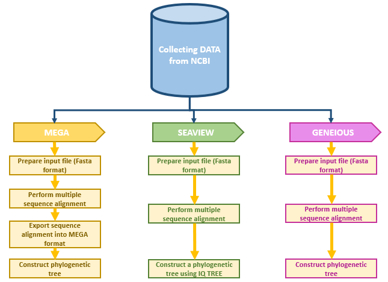
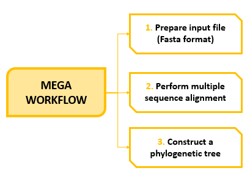
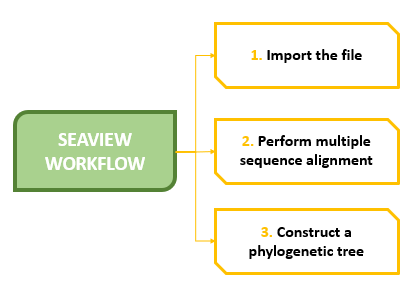
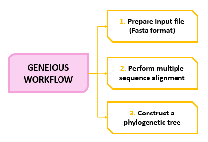
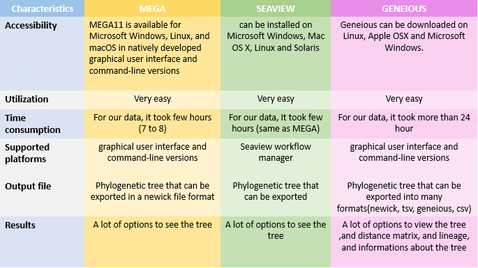

# Comparative Study between Molecular and Genetic Evolutionary Analysis Tools Using African SARS-CoV-2 Variants
#### Our Team. Lead: Nouhaila En najih, Awe Olaitan, Marion Nyaboke Nyamari- Writers: Latifah Benta Mukanga

## Abstract
Phylogenetic analysis is considered to be a highly reliable and important bioinformatics tool. Currently we have many phylogenetic tools that biologists can use to interpret and visualize biological data. However, most of these tools require a lot of expertise and technical know-how for one to be able to use them. In this study, African SARS-CoV-2 Variants are used to compare three phylogenetic tools (MEGA, SeaView and Geneious) in terms of their ease of use, output and accessibility.

## Methods
### Data Collection

The SARS CoV 2 complete genome  sequences from different countries in the South African region were retrieved from the NCBI Virus repository (www.ncbi.nlm.nih.gov, n.d.) in fasta format.

### Data Preprocessing

### Phylogenetic Analysis

#### MEGA

MEGA11 is available for Microsoft Windows, Linux, and macOS in natively developed graphical user interface and command-line versions at www.megasoftware.net.  Both 32- and 64-bit versions of MEGA are available for download.

#### SEAVIEW

SeaView workflow manager can be installed on Microsoft Windows,Mac OS X,Linux and Solaris through  http://doua.prabi.fr/software/seaview.

#### GENEIOUS

## Results

## Team
* Olaitan I. Awe, African Society for Bioinformatics and Computational Biology, laitanawe@gmail.com
* Nouhaila En najih, Systems and Data Engineering team, National School of Applied Sciences, Abdelmalek Essaadi University,Tangier, Morocco, nouhailaennajih25@gmail.com
* Marion Nyaboke Nyamari, School of Pure and Applied Sciences, Pwani University, Kenya, marionnyaboke01@gmail.com
* Latifah Benta, Department of Life Sciences, South Eastern Kenya University, Kitui,Kenya, latifahmukanga@gmail.com
